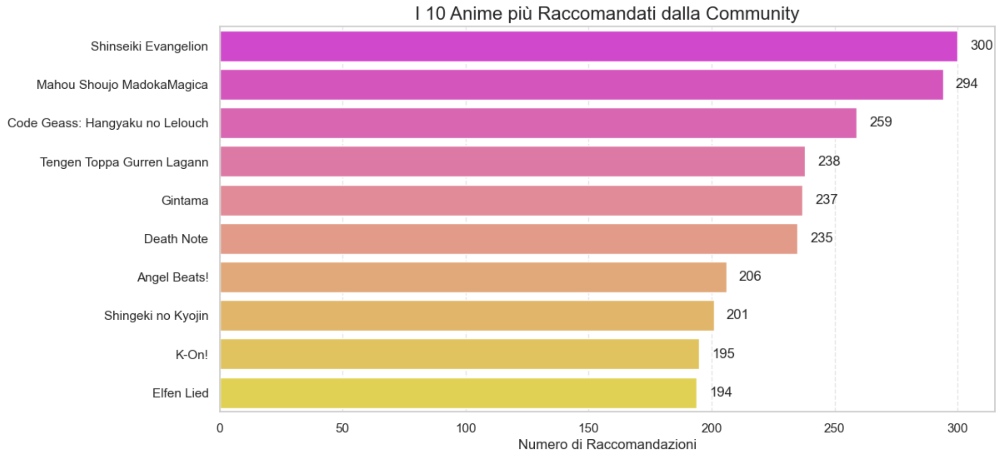
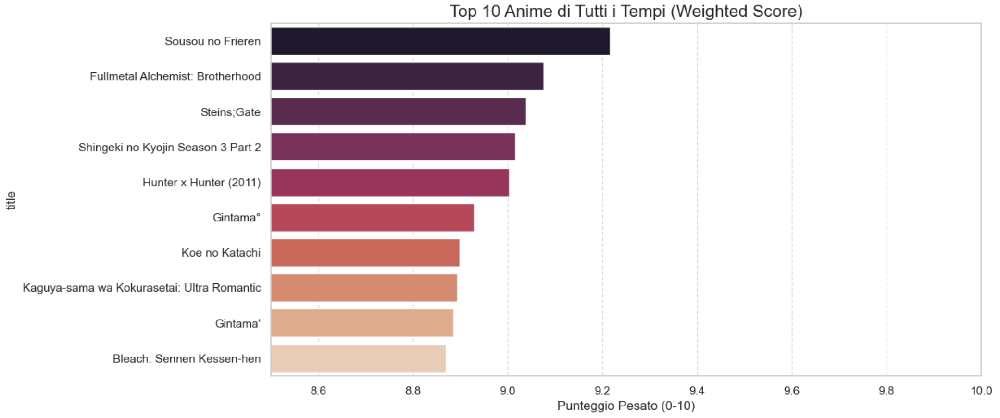
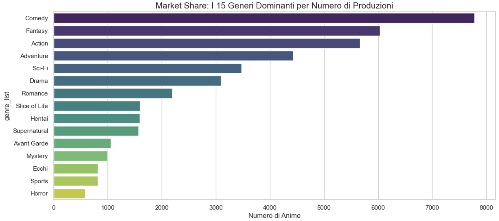
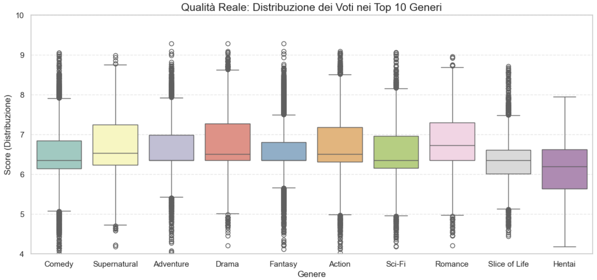
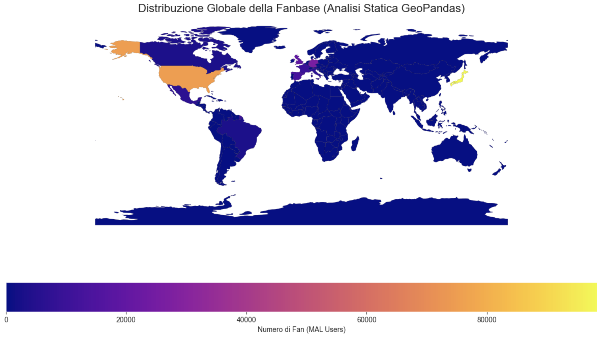

# Analisi Comparativa delle Interazioni su Twitter: Fans vs Journalists

**Team Name:** Gruppo Scandone, Riccioni, Serranò.
**Date:** [14/01/2026]

## Introduzione

Il presente report documenta la strategia di progettazione, implementazione e analisi adottata per esaminare le differenze in ambito anime dedicato a due macro categorie, analizzeremo gli anime per gli occhi dei "Fans" e dei "Journalist". Il progetto volge a mettere in luce le caratteristiche più emergenti sotto tutti gli aspetti che riguardano i datasets. La soluzione è stata sviluppata utilizzando Python, strutturando il flusso di lavoro in moduli sequenziali (Notebook Jupyter) che coprono l'intero ciclo di vita del dato: dalla pulizia preliminare (Preprocessing) all'analisi esplorativa nelle due categorie, fino alla visualizzazione geospaziale.

---

## Technical Task 1: Data Cleaning and Preprocessing

### Solution

**Design and its motivations (dal rumore al segnale):**  
La fase di preparazione dei dati è stata implementata nel notebook [solution/0_Data_Cleaning.ipynb](vsls:/solution/0_Data_Cleaning.ipynb) ed è progettata come **un “filtro narrativo”**: prima di raccontare *cosa* dicono Fans e Journalists, bisogna rendere i dati **coerenti, confrontabili e riproducibili**.  
L’idea guida è semplice: un’analisi comparativa funziona solo se entrambe le prospettive (Fan/Journalist) partono **dallo stesso suolo solido**. Per questo tutte le trasformazioni vengono centralizzate in un unico notebook “a monte”, e l’output viene salvato in **cache** (file `.pkl`) così da:

- garantire **stesse identiche versioni** dei dataset per tutti i notebook successivi;
- ridurre i tempi di esecuzione (no cleaning ripetuto);
- favorire debugging e tracciabilità (pipeline deterministica).

L’implementazione usa **Pandas** perché consente trasformazioni vettoriali e operazioni di pulizia/normalizzazione efficienti su dataset medio-grandi, mantenendo il workflow leggibile e verificabile.

---

#### Pipeline logica (3 passaggi, un unico obiettivo: uniformare)
Nel notebook, la pulizia è strutturata in tre blocchi consecutivi, ciascuno con un “perché” preciso (cioè il motivo dei controlli e dei grafici/contatori che tipicamente accompagnano la fase di ispezione).

1) **Ingestione & Verifica (capire cosa c’è davvero nel dato)**  
   Si caricano i dataset grezzi e si esegue una prima ispezione: dimensioni, colonne disponibili, tipi di dato e presenza di anomalie (valori nulli, duplicati, campi incompleti).  
   **Motivazione:** prima di pulire bisogna *misurare il problema*; questa fase evita che l’analisi successiva venga influenzata da errori silenziosi (es. date lette come stringhe, colonne numeriche sporche, record duplicati).

2) **Normalizzazione del testo (rendere confrontabili contenuti nati “sporchi”)**  
   Il notebook si occupa della pulizia dei datasets: rimozione di URL, caratteri non informativi/punteggiatura non semantica e uniformazione (lowercase).  
   **Motivazione:** la normalizzazione riduce la variabilità artificiale (stesso concetto scritto in mille modi) e prepara i campi all'analisi dei prossimi Notebook.

3) **Standardizzazione temporale (mettere tutti gli eventi sulla stessa linea del tempo)**  
   Le colonne data/ora vengono convertite in `datetime64` di Pandas e uniformate per abilitare aggregazioni temporali (resampling, trend, confronti per finestre).  
   **Motivazione:** la componente temporale è spesso il “filo” che unisce i comportamenti; senza una timeline consistente, qualsiasi trend può diventare un artefatto di parsing.

---

#### Output: cache come “contratto” tra cleaning e analisi  
Al termine della pipeline, i dataset puliti vengono serializzati in una cartella **cache** come `.pkl`. Questo output diventa il **punto di verità** (single source of truth) utilizzato dai notebook analitici: le scelte fatte qui determinano la qualità e la comparabilità delle analisi Fan/Journalist.

---

### Issues

Durante lo sviluppo del modulo di preprocessing sono emerse criticità tipiche dei dati, che il notebook affronta esplicitamente con controlli e scelte conservative:

- **Eterogeneità dei formati:** date e codifiche non sempre uniformi (specie se i dataset provengono da esportazioni diverse). Questo richiede conversioni robuste e verifiche post-parsing.  
- **Valori mancanti (NaN):** alcuni record hanno campi essenziali incompleti. La strategia adottata è stata **drop selettivo** quando manca il testo (per evitare imputazioni che alterano il contenuto), e preservazione dei record quando i NaN riguardano metadati meno critici.  
- **Rumore nel testo:** emoji, slang, link troncati e pattern variabili rendono le regex un compromesso tra pulizia “aggressiva” e mantenimento del significato.

---

### Requirements

La soluzione soddisfa i requisiti di affidabilità e coerenza perché produce un dataset finale:

- **Privo di duplicati** (riduce distorsioni su conteggi e frequenze);  
- **Tipizzato correttamente** (date e numeri usabili per aggregazioni e correlazioni);  
- **Pronto per l’analisi** (testi normalizzati e timeline coerente, utilizzabili nei notebook successivi senza ulteriori correzioni ad hoc).

---

### Limitations

- **Scalabilità (in-memory):** Pandas richiede che i dati risiedano in RAM; l’approccio è efficace per i volumi attuali ma non per scale “big data” senza migrazione (Spark/Dask).  

---

## Technical Task 2: Comparative Analysis (Fans & Journalists)

### Solution

**Design and its motivations (due occhi, una sola storia):**  
Per rendere il confronto realmente significativo, l’analisi è stata divisa in due notebook speculari ma *complementari*: [solution/1_Fan_Analysis.ipynb](vsls:/solution/1_Fan_Analysis.ipynb) e [solution/2_Journalist_Analysis.ipynb](vsls:/solution/2_Journalist_Analysis.ipynb). La separazione non è “solo organizzativa”: è una scelta narrativa e metodologica. Entrambi i notebook partono dagli stessi dataset puliti e serializzati in cache (output della pipeline di cleaning), ma rispondono a due domande diverse:

- **Il Fan** cerca *il perché* di un culto: qualità percepita, icone creative, dinamiche di passaparola.
- **Il Journalist** cerca *il quadro generale*: trend storici, relazioni tra qualità e popolarità, logiche industriali e di mercato.

In altre parole: **stesso universo (catalogo anime), due punti di vista (micro vs macro)**. La “storia” che emerge è un viaggio dal dettaglio emotivo della community alla fotografia strutturale dell’industria.

---

### 1) Notebook Fan — *dentro il fandom: come nasce un “cult”*  
Nel notebook [solution/1_Fan_Analysis.ipynb](vsls:/solution/1_Fan_Analysis.ipynb) la sequenza dei grafici è pensata come una discesa progressiva *dalla classifica alla cultura*:

1. **La “vera classifica” (Weighted Rating)**  
   Il punto di partenza è un’idea semplice: la media aritmetica può ingannare. Un titolo con pochi voti altissimi non è comparabile, in modo equo, a un titolo con migliaia di valutazioni stabili. Per questo la classifica viene ricostruita con un punteggio pesato (weighted), che privilegia opere con consenso solido.  
   **Motivo del grafico:** mostrare la differenza tra “eccellenza percepita” e “rumore statistico”.

2. **Cast Analysis: la densità narrativa**  
   Un secondo grafico sovrapposto confronta **numero totale di personaggi** vs **main characters** nelle serie più “grandi”. L’insight è quasi controintuitivo: anche quando un mondo narrativo si espande, il cuore emotivo resta concentrato.  
   **Motivo del grafico:** spiegare *come* un’opera possa essere enorme senza perdere leggibilità: il fandom si lega a pochi fulcri.

3. **Le icone dell’industria (Top Staff / Seiyuu “stakanovisti”)**  
   Qui la domanda diventa: “chi regge davvero il sistema?”. La classifica delle persone con più ruoli accreditati rende visibile un pattern industriale: una parte del valore creativo è sostenuta da figure ricorrenti e iper-produttive.  
   **Motivo del grafico:** collegare il gusto dei fan a una realtà di filiera (talento ripetuto, firma autoriale, riconoscibilità).

4. **Passaparola e influenza (Recommendations)**  
   Il notebook mette poi in scena il suo snodo narrativo più forte: **“Qualità vs Influenza”**. Confrontando **Top Rated** e **Top Recommended** emerge che i due elenchi non coincidono: i “capolavori” non sono sempre i “gateway” d’ingresso.  
   **Motivo del grafico:** distinguere ciò che *è amato profondamente* da ciò che *si diffonde più facilmente* nella community.

   
   

---

### 2) Notebook Journalist — *fuori dal dettaglio: come si muove il mercato*  
Nel notebook [solution/2_Journalist_Analysis.ipynb](vsls:/solution/2_Journalist_Analysis.ipynb) l’ordine delle visualizzazioni costruisce una panoramica “da redazione”: prima la storia lunga, poi le relazioni strutturali, infine le dinamiche competitive.

1. **Setup & Ingestione (dataset dalla cache)**  
   Il notebook parte caricando dataset già ottimizzati (es. `anime.pkl`, `profiles.pkl`). Questa scelta garantisce riproducibilità, tempi rapidi e coerenza con l’intera pipeline.

2. **Qualità vs Popolarità vs Durata (matrice di correlazione)**  
   Una heatmap mette in relazione score, membri/popolarità e variabili di formato/durata. Qui entra il dubbio “giornalistico”: correlazione positiva tra popolarità e score è qualità reale o effetto bandwagon?  
   **Motivo del grafico:** trasformare la discussione da opinione a *ipotesi misurabile*.

3. **Il Boom: produzione annuale (1960–2024)**  
   Un grafico temporale mostra quanti titoli vengono rilasciati ogni anno, evidenziando crescita organica, accelerazione con digitale/streaming e stabilizzazione recente.  
   **Motivo del grafico:** contestualizzare tutto il resto: prima di discutere qualità o generi, bisogna capire *quanto* cresce (o si satura) il mercato.

4. **Evoluzione interattiva (bubble chart Plotly)**  
   Un grafico a bolle (asse X anno, asse Y voto, dimensione = fan/members) permette di “toccare” la storia: ogni punto è un titolo e il mercato diventa navigabile.  
   **Motivo del grafico:** dare al lettore uno strumento esplorativo, non solo una conclusione: il journalist *verifica*, non solo racconta.

5. **Analisi sui generi**
    Un grafico a barre orizontale in mostra quali sono i generi maggiromente prodotti, e quindi ci si aspetterebbe che questi generi siano anche i più graditi dal pubblico.

6. **Analisi sulle votazioni dei generi**
    Un Box Plot collega il genere degli anime con le loro valutazioni, e sorpendentemente notiamo come i generi più prodotti non sono quelli con una valutazione più alta.

7. **Analisi sull'Otaku Medio**
    Un grafico a barre ci aiuta a capire quale è il range di età di persone che visionano gli anime, e mettiamo in luce anche la media che ci fa capire che non sono destinati solo ad un pubblico bambino/adolescenziale ma è anche destinato ad un pubblico più adulto.

8. **Analisi sul fattore Noia**
    Un altro dato che sarebbe potuto essere interessante è quello riguardante il grafico che collega la percentuale di abbandono con la votazione media degli anime, ed effettivamente si nota che la percentuale di abbandono e la votazione media sono inversamente proporzionali, quindi all' abbassarsi della votazione dell'anime si alza la percentuale di abbandono.

9. **Analisi sulla lunghezza degli anime**
    In relazione al grafico sul fattore noia ci è interessato indagare sulla lunghezza degli anime, e si nota come durante l'avanzare degli anni si è andati incontro a uno standard di 12 episodi.

10. **Paradosso dei Generi e Studio Wars**  
   La parte finale ragiona su cosa viene prodotto, cosa viene premiato e chi domina (per volume vs qualità). È qui che la macro-analisi chiude il cerchio: le preferenze non sono sempre allineate alle scelte industriali.  
   **Motivo del grafico:** spiegare le tensioni tra domanda, offerta e strategie produttive.

   
   

---

### Issues

- **Bias di popolarità (bandwagon):** titoli con fanbase enorme possono trascinare verso l’alto score e visibilità, rendendo difficile separare qualità intrinseca e consenso sociale.  
- **Confrontabilità tra formati:** TV, OVA, ONA e film hanno cicli produttivi e target diversi; alcune metriche (es. durata/episodi) vanno interpretate per categoria.  
- **Sbilanciamento del catalogo:** la distribuzione è tipicamente “power law”: pochi giganti e una lunga coda di titoli di nicchia.

### Requirements

La sezione soddisfa i requisiti di “Meaningful Results” e “Strategy quality” perché non si limita a descrivere classifiche: ricostruisce **meccanismi** (weighted rating), **strutture narrative** (cast density), **driver sociali** (recommendations) e **dinamiche di mercato** (trend temporali, correlazioni, competitività tra studi), mantenendo coerenza tra i due punti di vista.

---

## Technical Task 3: Geospatial Analysis (Where: la geografia della conversazione)

### Solution

**Design and its motivations (dalla timeline alla mappa):**  
Il notebook [solution/3_Geo_Analysis.ipynb](vsls:/solution/3_Geo_Analysis.ipynb) chiude il cerchio dell’analisi spostando la domanda dal *“cosa”* e *“quanto”* al **“dove”**. Dopo aver reso i dati puliti e comparabili (Task 1) e averli letti con due lenti diverse (Task 2), la geospatial analysis serve a verificare un’ipotesi semplice ma potente: **la stessa conversazione non vive ovunque allo stesso modo**.  
Se Fans e Journalists mostrano pattern diversi, allora dovrebbero emergere anche **asimmetrie territoriali** (concentrazione, copertura, polarizzazione per aree).

---

### Pipeline logica (dal campo “location” a una vista cartografica affidabile)
Il notebook costruisce la mappa come una sequenza di trasformazioni conservative, pensate per minimizzare artefatti:

1) **Selezione del segnale geografico (cosa è davvero “locazione”)**  
   I dati social contengono geografie di qualità variabile: geo-tag espliciti (rari), campi `place`, location libera nel profilo (rumorosa), abbreviazioni e toponimi ambigui.  
   **Motivo dei contatori iniziali:** quantificare *quanta* parte del dataset è effettivamente “mappabile” e con quale affidabilità (coverage).

2) **Normalizzazione e disambiguazione (trasformare testo in luogo)**  
   Il campo relativo al Paese di provenienza viene pulita e normalizzata, in modo tale da non creare problemi nella lettura e creazione del grafico, in quanto i Paese possono essere chiamati in modo diverso in base alla propria cultura.

---

### I grafici come “storia”: dalla copertura ai poli d’attenzione
La sequenza delle visualizzazioni è costruita come un racconto in tre atti, ognuno risponde a una domanda precisa:

1) **Atto I — “Quanto è mappabile?” (coverage e qualità del dato)**  
   Prima di disegnare confini, il notebook chiarisce quanta parte dei profili ha un’informazione geografica utilizzabile.  
   **Motivo dei grafici/contatori:** evitare l’illusione di precisione (una mappa bella ma basata su pochi dati).

2) **Atto II — “Dove si concentra la conversazione?” (heat/choropleth e hotspot)**  
   La mappa principale mostra **densità e distribuzione**: aree ad alta intensità e lunga coda di territori con presenza marginale.  
   **Motivo della mappa:** trasformare la conversazione in “territorio”, cioè rendere visibili cluster e squilibri che una tabella non comunica, in modo tale che saltino all'occhio dell'utente.

3) **Atto III — Mappa Interattiva**
    Abbiamo creato un'altra mappa interattiva che permette una miglior esplorazione di essa, è fornita di zoom in/out e un hovering interattivo.
---

### Issues

- **Bias di compertura:** la location di profilo è spesso creativa/ambigua, in quanto molti paese non vengono minimamente menzionati all'interno dei datasets

### Requirements

La sezione soddisfa i requisiti di comparabilità perché applica una trasformazione controllata (normalizzazione → geocoding/mapping → aggregazione) e produce visualizzazioni che rendono misurabile il “dove” delle popolazioni, mantenendo coerenza con i dataset puliti usati nei notebook Fan e Journalist.

### Limitations

- **Geocoding e falsi positivi:** toponimi ambigui e stringhe non standard possono introdurre errori di assegnazione.  
- **Rappresentatività:** l’assenza di geo-tag per molti utenti limita inferenze “forti” su tutto il pubblico.  
- **Comparazioni temporali:** se si volesse analizzare anche l’evoluzione geografica nel tempo, servirebbe una copertura più stabile e un controllo più rigoroso dei missing.